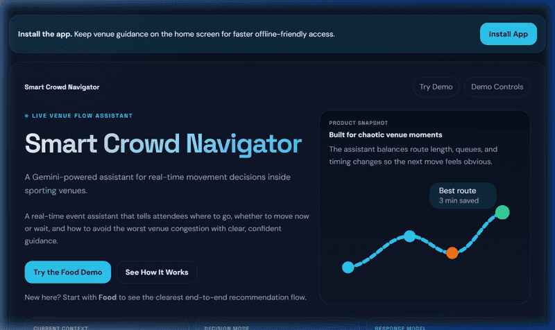
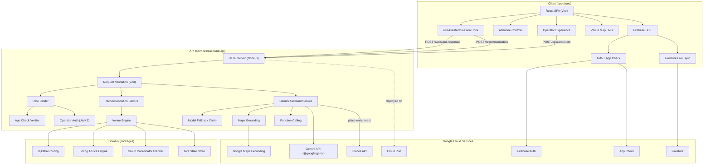

# Smart Crowd Navigator

Smart Crowd Navigator is a production-style web application for large sporting venues. It helps attendees decide where to go, whether to move now or wait, and how to avoid unnecessary crowd pressure using a deterministic venue engine, a Gemini-powered assistant layer, live venue-state updates, and Maps-grounded nearby-place guidance when a question extends beyond the venue perimeter.




## Live deployment

- **Cloud Run URL:** `https://smart-crowd-navigator-6onqsv3h4a-uc.a.run.app`
- **Runtime model:** one deployed URL serving both the web app and the API

## What the product does

The application is designed for the **Physical Event Experience** problem space and focuses on three practical outcomes:

- improving crowd movement
- reducing waiting times
- supporting real-time coordination

The primary user is a **group coordinator** at a venue — the person making movement decisions for a family or friend group.

Typical questions the product answers:

- Which food stall should our group use right now?
- Should we go now or wait a few minutes?
- Which exit is currently smoother?
- What is the best regroup plan for a larger group?
- Where is the best nearby pickup point outside the venue perimeter?

## Core product capabilities

### Attendee experience

- mobile-first React web app
- free-text assistant chat plus quick-action entry points
- attendee context controls for section, party size, event phase, group coordination mode, and mobility mode
- installable web manifest plus cached offline shell for weak-connectivity venue areas
- live recommendation card with:

  - primary option
  - go-now / wait guidance
  - ETA
  - queue time
  - route summary
  - crowd warning
  - fallback option
  - group coordinator plan when relevant
- venue map panel with recommended destination highlighting
- Google Maps citations plus an inline map preview for venue-perimeter answers
- official Google Maps Embed API preview when `VITE_GOOGLE_MAPS_API_KEY` is configured, with a no-key fallback for demo resilience
- Places API enrichment for grounded nearby locations when Gemini returns a `placeId`, fetched through a backend proxy route

### Decision engine

- deterministic venue engine in TypeScript
- venue graph with sections, concourses, ramps, stairs, elevator paths, gates, exits, food, and washrooms
- scoring based on:

  - walking time
  - queue delay
  - crowd pressure
  - event-phase penalty
  - telemetry confidence / variability
  - party-size service penalty
  - accessibility and mixed-mobility routing constraints
- explicit wait-vs-go timing advice
- group workflow support such as:

  - runner pickup
  - meet-up routing
  - return-before-play guidance

### Live state and operations

- operator console for live venue-state changes
- explicit live-state store boundary in the API
- Firebase-backed live venue-state sync path
- local fixture-backed fallback path for deterministic development and test runs

### Assistant layer

- Gemini-backed assistant responses via `@google/genai`
- stateful multi-turn chat architecture
- bounded model fallback chain:

  - `gemini-3.1-flash-lite-preview`
  - `gemini-3-flash-preview`
  - `gemini-2.5-flash`
- deterministic fallback mode when Gemini is disabled or unavailable
- Google Maps grounding for venue-perimeter questions

## Google services in use

- **Gemini API** — grounded assistant responses
- **Google Maps grounding through Gemini** — nearby-place and perimeter guidance
- **Cloud Run** — deployed runtime for the web app and API
- **Firebase Auth** — operator sign-in path
- **Firestore** — live venue-state persistence path
- **Firestore Security Rules** — protected write access for live state
- **Firebase App Check** — protected client/backend request verification path

## System architecture

### Frontend

- React
- TypeScript
- Vite
- mobile-first UI

### Backend

- Node.js
- TypeScript
- Cloud Run-friendly API boundary
- Gemini orchestration and deterministic routing integration

### Shared/domain packages

- `packages/shared` — request/response contracts and constants
- `packages/venue-engine` — venue topology, routing, ranking, timing advice, and group plan logic

### Architecture diagram



## How the recommendation flow works

1. The attendee provides context such as section, party size, mobility mode, and event phase.
2. The backend computes the recommendation with the deterministic venue engine.
3. Gemini turns the grounded result into a more natural assistant response.
4. If the question is venue-perimeter related, Google Maps grounding is used to add nearby-place context and citations.
5. If live venue state changes, recommendations update accordingly.

## Security and reliability

The current implementation includes:

- server-side Gemini key handling
- input validation on request payloads
- App Check support
- operator auth support
- Firestore rules for protected writes
- rate limiting and structured API safeguards
- deterministic fallback behavior when AI/model calls are unavailable

Relevant docs:

- [docs/security-review.md](./docs/security-review.md)
- [docs/operations-runbook.md](./docs/operations-runbook.md)
- [docs/production-secrets.md](./docs/production-secrets.md)

## Accessibility

The shipped UI is designed around:

- keyboard-accessible interaction
- visible focus treatment
- skip-link support
- screen-reader-friendly status and recommendation regions
- reduced-motion support
- higher-contrast and forced-colors hardening
- semantic conversation transcript + grounded-place regions
- automated `axe-core` Playwright coverage for the attendee shell
- accessible-route support in the venue engine

## Testing and verification

The repository includes:

- engine unit tests
- API integration tests
- web rendering tests
- Playwright accessibility smoke coverage for the attendee shell
- Playwright `axe-core` accessibility audit coverage
- Playwright end-to-end coverage for:

  - attendee chat follow-ups
  - accessibility smoke checks
  - maps-grounded citation rendering
  - group coordinator plan rendering
  - live operator update flows
  - combined attendee regression lanes

Primary local verification command:

```bash
pnpm verify
```

Other useful commands:

```bash
pnpm test:e2e
pnpm test:gemini-real
pnpm coverage
```

## Local development

```bash
pnpm install
pnpm setup:local
pnpm dev
```

Then open:

- web: `http://127.0.0.1:5173`
- API: `http://127.0.0.1:8080`

## Submission compliance checklist

- repository visibility: public
- branch policy: keep only `main` on the remote for challenge submission
- branch verification command: `git ls-remote --heads origin` should list only `refs/heads/main`
- repository size guard: verify source archive size before submission (`git archive --format=zip -o crowd-head.zip HEAD`)
- package manager consistency: use pnpm-only lockfiles and scripts
- pre-submit checks:

  - `pnpm verify`
  - `pnpm test:e2e`

## Assumptions

- the demo venue model and local fixture represent one stadium-like environment, not all venue topologies
- attendee recommendations are operational guidance, not safety-critical routing instructions
- App Check and operator-auth toggles are environment-controlled and expected to be enforced in production
- Maps-grounded answers are used for venue-perimeter or nearby-place questions, while indoor routing remains deterministic
- operator-state reads are intentionally public in the current demo posture

## TypeScript compatibility notes

- deprecated `baseUrl` is removed from shared compiler options; workspace aliases use explicit path mappings
- `services/assistant-api` intentionally sets `rootDir` to `../..` to preserve its current emit layout for the build flatten step and runtime static-asset path expectations

## Repository structure

- `apps/web` — attendee UI and operator experience
- `services/assistant-api` — API routes, Gemini boundary, request validation, static serving, and shared HTTP request utilities (`src/request-utils.ts`)
- `packages/shared` — shared contracts and constants
- `packages/venue-engine` — deterministic route ranking, timing advice, and group workflow logic
- `tests/e2e` — end-to-end regression coverage
- `docs/` — deployment, QA, security, operations, privacy, and support docs

## Challenge Reviewer Checklist

- vertical/persona: physical event experience with group coordinator as the primary persona
- instructions coverage: README includes approach, logic, architecture, assumptions, and local verification commands
- code quality: strict TypeScript, modular packages, and lint/typecheck/test/build gates
- security: App Check support, operator auth path, rate limits, CORS policy, and Firestore rules
- efficiency: deferred operator bundle, cached attendee shell, and deterministic engine for core routing decisions
- testing: package unit tests plus Playwright e2e and accessibility checks
- accessibility: skip link, focus-visible styling, semantic live regions, and axe coverage
- Google services: Gemini, Maps grounding, Cloud Run, Firebase Auth, Firestore, and App Check

## Documentation

- [CONTRIBUTING.md](./CONTRIBUTING.md)
- [docs/cloud-run-deploy.md](./docs/cloud-run-deploy.md)
- [docs/firebase-handoff.md](./docs/firebase-handoff.md)
- [docs/qa-report.md](./docs/qa-report.md)
- [docs/assistant-behavior-regression.md](./docs/assistant-behavior-regression.md)
- [docs/release-confidence.md](./docs/release-confidence.md)
- [docs/security-review.md](./docs/security-review.md)
- [docs/venue-engine-performance.md](./docs/venue-engine-performance.md)
- [docs/privacy-policy.md](./docs/privacy-policy.md)
- [docs/terms-of-use.md](./docs/terms-of-use.md)
- [docs/support-and-security.md](./docs/support-and-security.md)
- [docs/venue-data-contract.md](./docs/venue-data-contract.md)
- [docs/gemini-conversation-architecture.md](./docs/gemini-conversation-architecture.md)
- [docs/gemini-model-fallbacks.md](./docs/gemini-model-fallbacks.md)
- [docs/maps-grounding-guidance.md](./docs/maps-grounding-guidance.md)

## References

- [Gemini text generation](https://ai.google.dev/gemini-api/docs/text-generation)
- [Gemini function calling](https://ai.google.dev/gemini-api/docs/function-calling)
- [Gemini structured output](https://ai.google.dev/gemini-api/docs/structured-output)
- [Gemini Maps grounding](https://ai.google.dev/gemini-api/docs/maps-grounding)
- [Firestore realtime listeners](https://firebase.google.com/docs/firestore/query-data/listen)
- [Firestore security rules](https://firebase.google.com/docs/firestore/security/get-started)
- [Firebase App Check](https://firebase.google.com/docs/app-check/web/recaptcha-provider)
- [Cloud Run auth](https://cloud.google.com/run/docs/authenticating/service-to-service)
